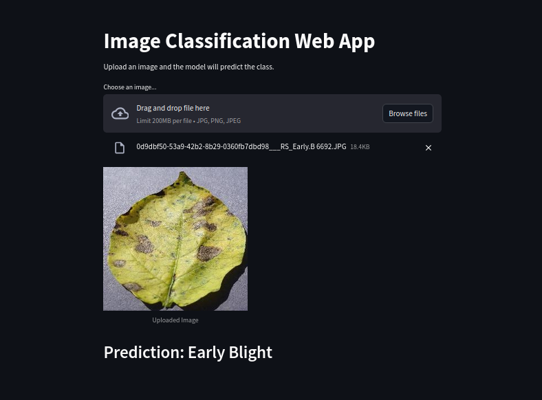

## 🌿 Potato Leaf Disease Classification using CNN

This is a Simple project predicts whether a potato leaf has a disease using **Convolutional Neural Networks (CNN)**. It classifies leaves into one of three categories:
- **Early Blight**
- **Late Blight**
- **Healthy**
> **Note:** Try to perform more epochs. Although I tried running it on Google Colab, my system tends to hang.

### ✨ Features
- Deep Learning-based Classification
- Real-time Image Prediction using **Streamlit**
- Image Processing with **OpenCV**
- Data Manipulation using **Pandas** and **NumPy**
- Visualization with **Matplotlib**

### 📅 Dataset
- The dataset for this project was obtained from **[Kaggle](https://www.kaggle.com/datasets/arjuntejaswi/plant-village)**, containing labeled images of potato leaves.

### 🎥 Project Interface



### 🚀 Tech Stack
- **Python**
- **TensorFlow / Keras** (for CNN model)
- **Streamlit** (for UI)
- **OpenCV** (for image preprocessing)
- **Pandas** and **NumPy** (for data manipulation)
- **Matplotlib** (for visualizations)

### ⚡ Installation
1. Clone the repository:
    ```bash
    git clone https://github.com/yourusername/potato-disease-classification.git
    ```
2. Navigate to the project directory:
    ```bash
    cd potato-disease-classification
    ```
3. Install dependencies:
    ```bash
    pip install -r requirements.txt
    ```
4. Run the application:
    ```bash
    streamlit run app.py
    ```

### 📈 Results
- The model achieved high accuracy in classifying potato leaf diseases.
- Real-time predictions are displayed using the Streamlit interface.

### 📖 Documentation
- [Streamlit Docs](https://docs.streamlit.io/)
- [Pandas Docs](https://pandas.pydata.org/docs/)
- [NumPy Docs](https://numpy.org/doc/stable/)
- [OpenCV Docs](https://docs.opencv.org/)
- [Matplotlib Docs](https://matplotlib.org/stable/contents.html)

### 🛠 Future Enhancements
- Add more classes for other diseases.
- Improve model accuracy using data augmentation.
- Integrate real-time video input for continuous prediction.

### 👥 Contributing
Contributions are welcome! Please fork the repository and submit a pull request.

### 🛡️ License
This project is licensed under the MIT License - see the [LICENSE](LICENSE) file for details.

---
*Happy Coding! 🚀*

